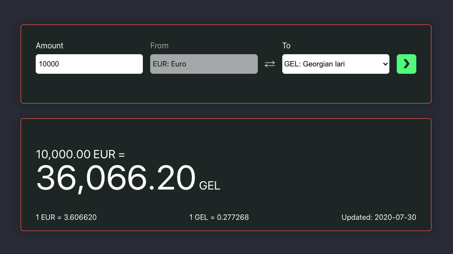

# Description
- The application uses rest services provided by the [Bank of Lithuania](https://www.lb.lt/webservices/FxRates/) for currency exchange rates;
- Currencies and exchange rates are stored in an sqlite database;
- The client communicates with the database via backend services using Node.js server;
- Currency exchange rates are also retrieved via backend services;
- User activity is logged in the database (Personal information is not logged as per GDPR);
- The test suit is made at the Modul and Server levels using Mocha.
- The build is deployed to Heroku. 

# Quick guide
- To run the application locally, install dependencies from both package.json files, at:
    - /root/package.json
    - /root/client/package.json
- Otherwise, to open it in the browser please [click here](https://euro-rates.herokuapp.com/);

# Preview

